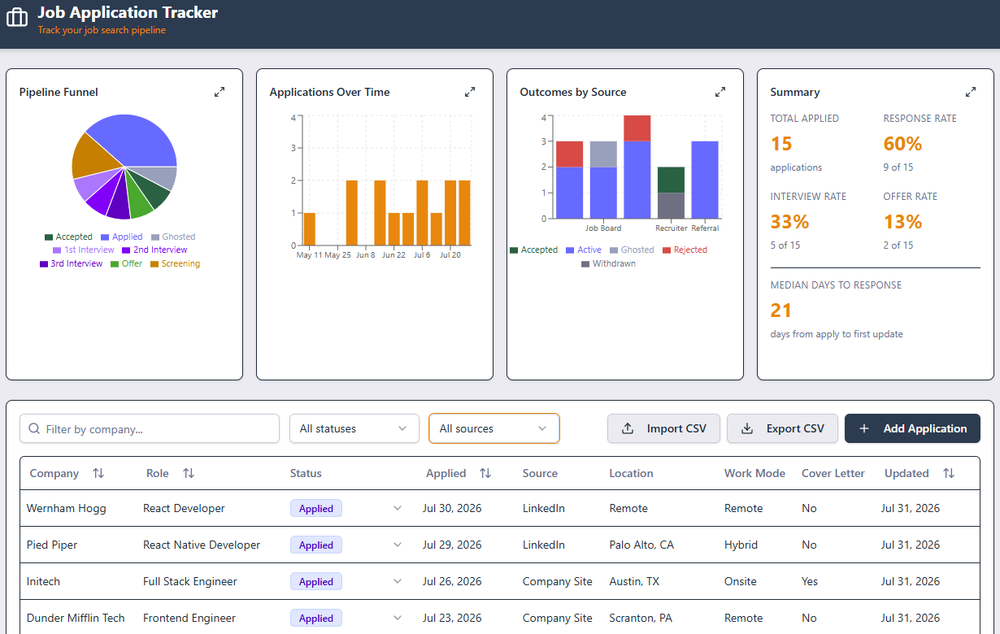
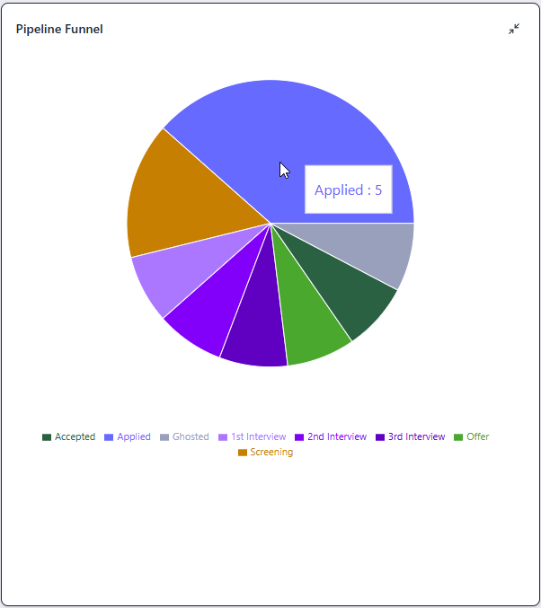
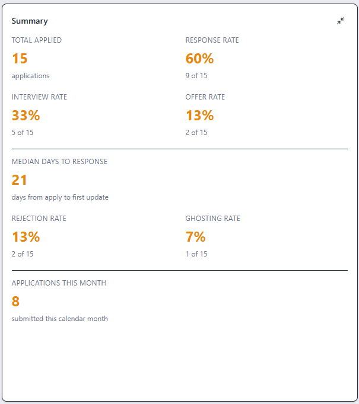
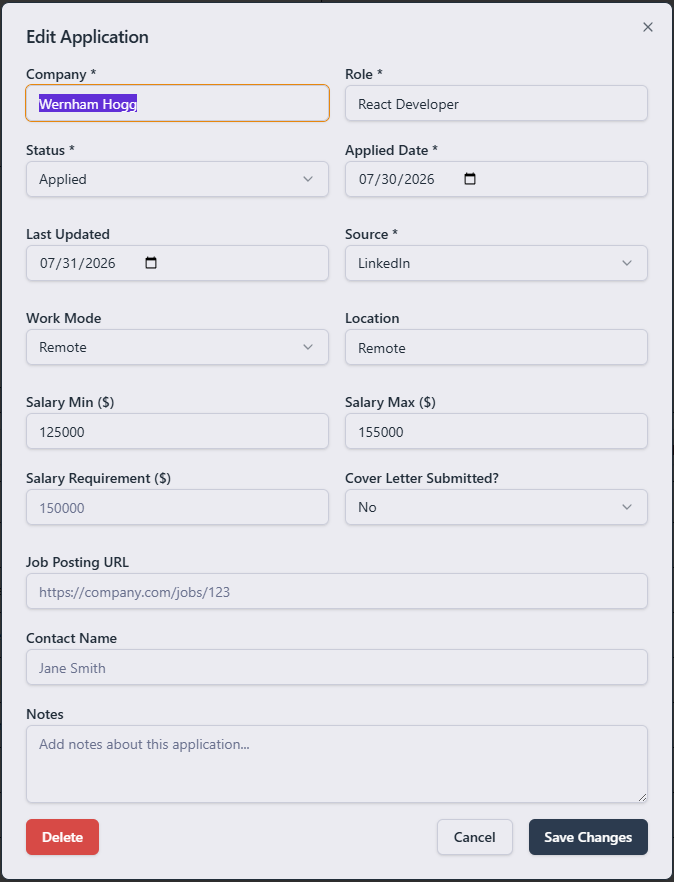
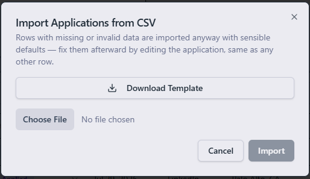

# Job Application Tracker

A single-user web app for tracking a job search: one table for every application, one row of
charts summarizing the pipeline at a glance.



## Features

- **Applications table** — sortable, filterable by status/source/company, inline status changes,
  and a full edit form (company, role, status, dates, salary range + your own salary requirement,
  work mode, source, cover letter submitted, contact, notes).
- **Pipeline funnel, as a pie chart** — applied → screening → 1st/2nd/3rd interview → offer →
  accepted, plus a derived "ghosted" slice for anything gone quiet 30+ days.
- **Expandable charts** — expand any chart or the summary card to take a closer look; expanding
  hides the other three so the expanded one gets the room.

   

- **Summary stats** — response/interview/offer rates, median days to first response, and
  (expanded) rejection rate, ghosting rate, and applications this month.
- **CSV import & export** — download a template, fill it in, and import; missing or invalid
  fields get sensible defaults instead of rejecting the row, so you fix them in place afterward.

   

## Stack

Vite + React 19 + TypeScript, Tailwind CSS v4 + shadcn/ui, TanStack Table, Recharts, React Hook
Form + Zod, Hono + SQLite.

## Getting started

```bash
npm install
npm run db:migrate  # create the SQLite tables
npm run db:seed     # optional — sample data
npm run dev         # API + Vite dev server → http://localhost:5173
```

Other useful commands: `npm run build`, `npm run typecheck`, `npm run test`. See `CLAUDE.md` for
the full data model and architecture notes.
